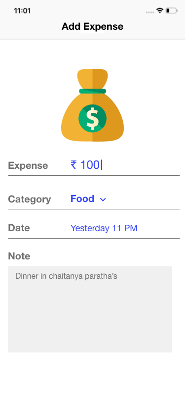
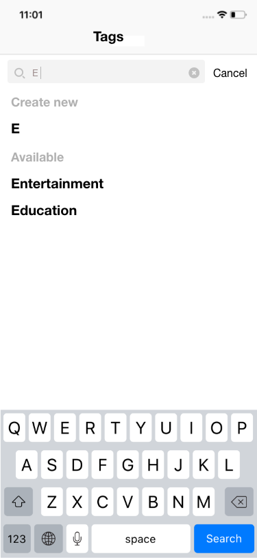
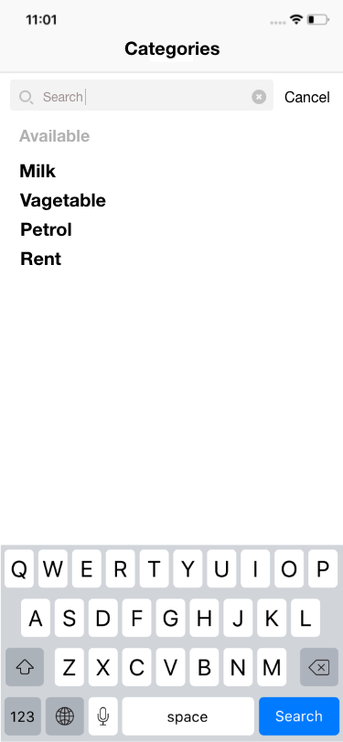
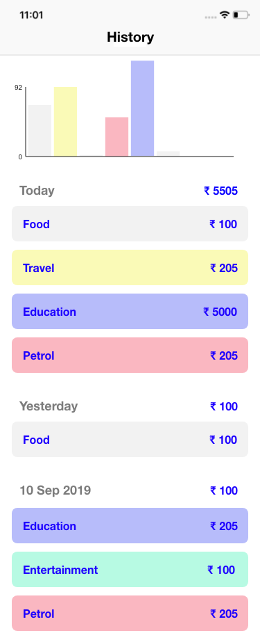

# ExpenseCalculator
Keeps track of your expense

## Problem statement
Create a beautiful expense tracker which will analyse the expense and will create beautiful charts by keeping your data safe on local

## Adobe XD wireframes
| Add expense | Add Tag | Category Listing | History  |
|---------------------|-------------|---------|--------|
| |  |  |  |

## Task List
- [ ] Add Expense
- [ ] Add Category
- [ ] Add Tag
- [ ] Store data in local (using core data)
- [ ] Expense history
- [ ] Pie chart of expense
- [ ] Categories expense
- [ ] Add expense remainder (Add expense from notification)

